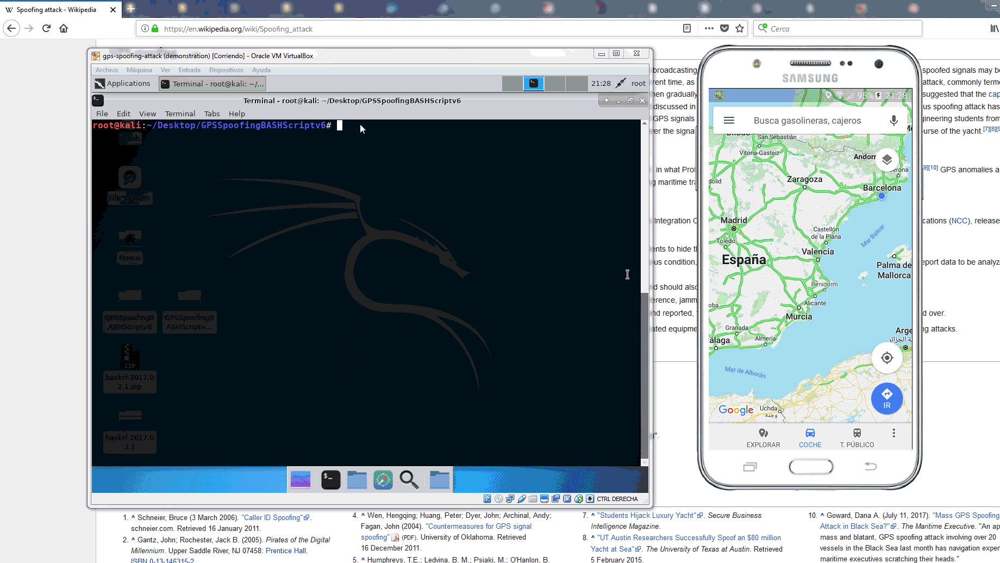

# ethicalhacking-gps

## What is ethical hacking and what is it used for?

Ethical hacking involves a hacker agreeing with an organisation or individual who authorizes the hacker to levy cyber attacks on a system or network to expose potential vulnerabilities. An ethical hacker is also sometimes referred to as a white hat hacker. Many depend on ethical hackers to identify weaknesses in their networks, endpoints, devices, or applications. The hacker informs their client as to when they will be attacking the system, as well as the scope of the attack.

## GPS ethical hacking

We should find out threats and vulnerabilities in those systems (and mitigate them).

For example, GPS spoofing attack is the process of generating a faked version of GPS signal to disturb the navigation and time synchronization process of the receiver. The receiver is a smartphone with the Google Maps app for this case. The GPS position moves from Barcelona to Villanueva de la Cañada (Madrid).

For this hacking demonstration, I used HackRF and Bash scripting.

